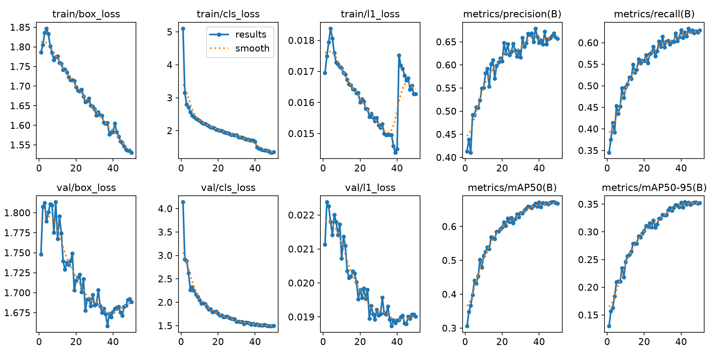
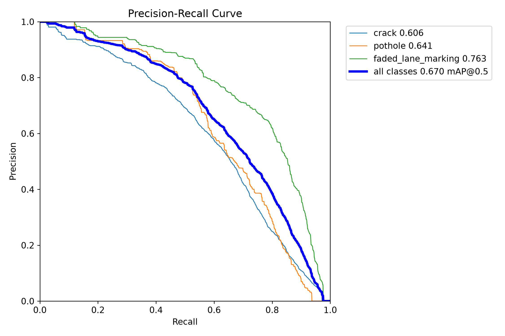
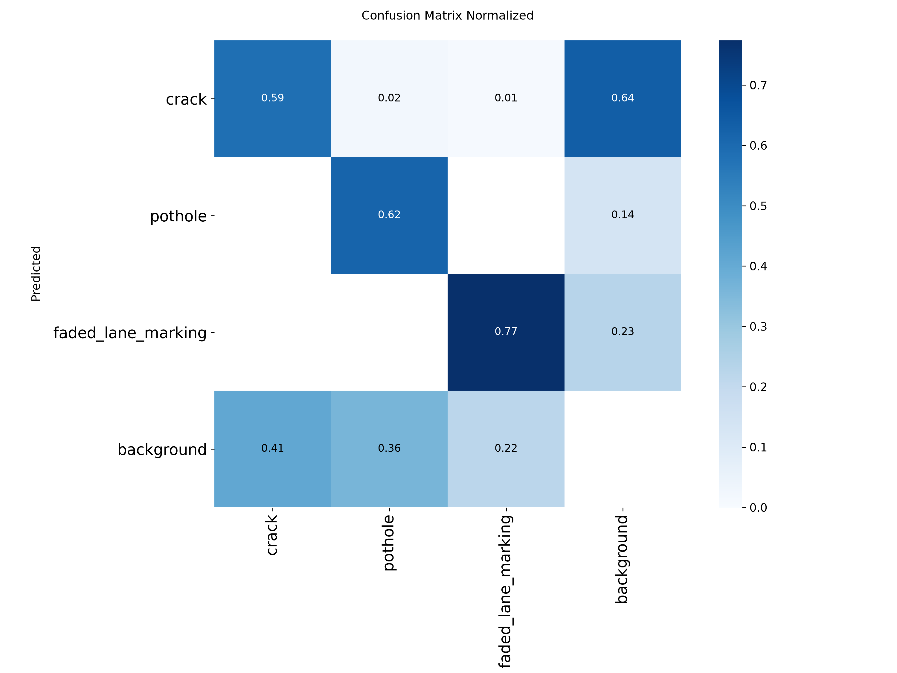
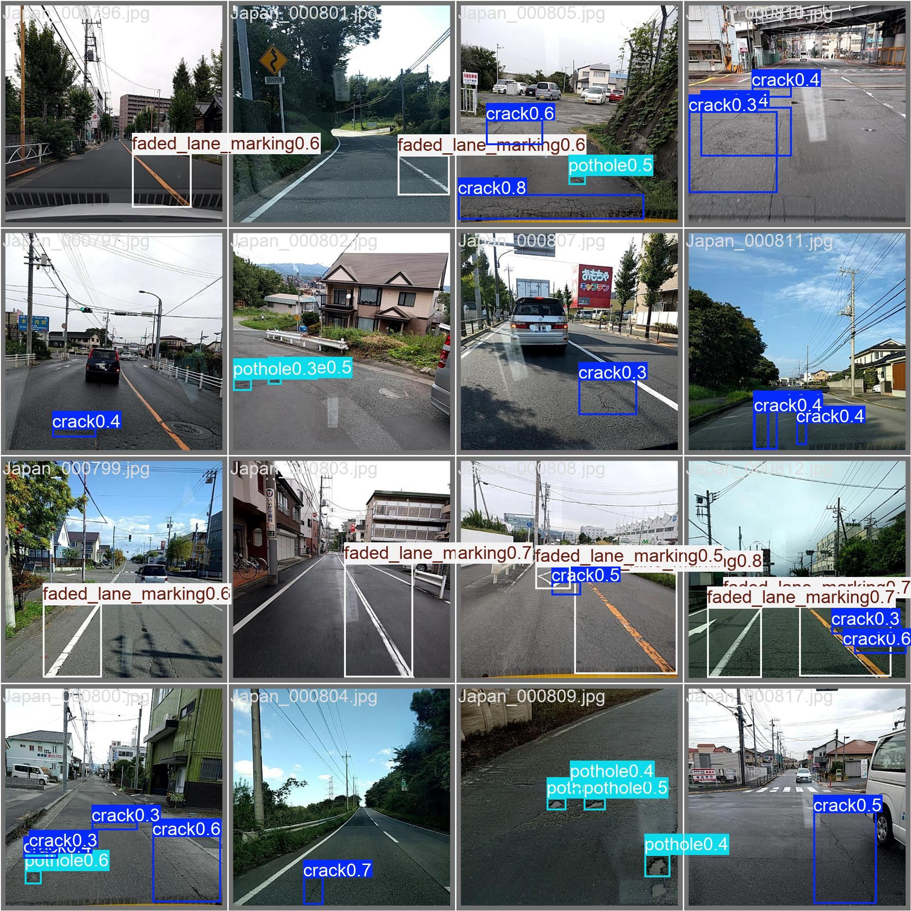

# Road Surface Defect Detection: From Training to a Live API

Detecting potholes, cracks and faded lane markings in street-level photos, and serving the model as a public API and a web demo.

**Live demo:** https://d3bkmt7m0crpe6.cloudfront.net
**API docs (Swagger):** https://3df26dtww4f3vvifrajnuligj40tpjfi.lambda-url.eu-central-1.on.aws/docs

## Project Background

Road surface damage is found today mostly by manual inspection or citizen reports. Automated detection on photos can help road maintenance teams and municipal services triage reports and prioritise repairs, and can feed reporting apps that let drivers flag defects.

This project covers the full lifecycle of such a model, end to end:

- **Training** a YOLO26n object detector on the RDD2022 road damage dataset (Japan subset).
- **Experiment tracking** and model versioning with MLflow, including a registry alias (`@champion`) for the model that serves.
- **Serving** through a FastAPI application that accepts an image and returns boxes, classes and confidences.
- **Packaging** the service as a Docker image built for AWS Lambda (via the Lambda Web Adapter).
- **Deployment** to AWS Lambda with a public Function URL, plus a static demo page on S3 and CloudFront.

The goal was a working, reproducible pipeline that a reviewer can run, not a state-of-the-art model.

## Data Structure

The model is trained on the **RDD2022 Japan** subset: 8,928 labelled street-level images in Pascal VOC format, converted to YOLO format.

| Split | Images | Share |
|---|---|---|
| train | 6,228 | ~70% |
| val | 1,775 | ~20% |
| test | 925 | ~10% |

Classes: `crack`, `pothole`, `faded_lane_marking`. In the validation split there are 4,048 instances: 2,764 cracks, 439 potholes, 845 faded markings.

Frames in RDD2022 come from continuous road surveys, so neighbouring images are almost duplicates. A random split would leak near-identical frames into the test set and inflate every metric. The split (`src/road_defect/data/split.py`) therefore assigns **contiguous blocks of 25 frames** to one split, with a fixed seed.

Raw data is not committed. Download and prepare it with:

```bash
uv run python -m road_defect.data.download_rdd
uv run python -m road_defect.data.voc_to_yolo
uv run python -m road_defect.data.split
```

## Executive Summary

### Overview of Findings

The final model (YOLO26n, 50 epochs, 640 px) reaches **mAP50 0.670** and **mAP50-95 0.354** on the validation split, with precision 0.660 and recall 0.613.

| Class | mAP50 | Notes |
|---|---|---|
| `faded_lane_marking` | 0.763 | Largest objects, most consistent |
| `pothole` | 0.641 | Few training examples (439 val instances) |
| `crack` | 0.606 | Most instances, but thin and low-contrast |

Inference is fast: about 3 ms per image on an RTX 3050 laptop GPU, and 40–80 ms per image in a warm local container. The first request on AWS Lambda after a cold start takes several seconds while the model loads.



### Crack Detection Is the Hardest Class

Cracks have the most annotated instances but the lowest mAP50. The bottleneck is visual difficulty, not data volume: cracks are thin, elongated and low-contrast, and a small shift of a box sharply lowers IoU. More cracks alone are unlikely to fix this. Higher input resolution or a larger model is the more promising lever.

### Precision and Recall Trade-off

At the default confidence threshold of 0.25 the model is balanced (precision 0.66, recall 0.61). The web demo uses this threshold. Lowering it to 0.10 finds more defects but adds false positives, so the threshold should be set per use case.



### Error Analysis

The normalised confusion matrix shows where classes are confused with each other and with background.



### Example Predictions

Validation batch with model predictions, rendered by Ultralytics during training:



### Limitations

- **Domain shift.** Training images are Japanese dashcam frames at 600×600. Photos taken on phones, close-ups, other countries or other marking styles can fall outside that distribution.
- **Faded markings are a condition, not an object.** The class means *worn* markings. Fresh, bright lines are correctly ignored, so an empty result on a new road is expected.
- **Small test sample.** The reported numbers come from one validation split of ~1,800 images.

## Recommendations

1. **Upgrade the model before adding data.** Validation mAP has plateaued over the last ~8 epochs while training loss kept falling. A larger variant (`yolo26s` or `yolo26m`) is the next experiment.
2. **Raise input resolution for thin defects.** Training at `imgsz=960` or higher should help cracks. Budget for more GPU memory.
3. **Widen the data distribution.** The Mapillary collection client in `src/road_defect/data/mapillary.py` is implemented but not yet used for training. Adding diverse street photos would address the domain shift.
4. **Tune the confidence threshold per product.** A reporting tool that prefers recall needs a lower threshold than an automated repair queue.
5. **Add test-time augmentation** for a cheap accuracy gain at inference time.

## Architecture

```mermaid
flowchart LR
    A[RDD2022 images] --> B[VOC to YOLO, block split]
    B --> C[YOLO26n training]
    C -->|metrics, weights| D[(MLflow tracking + registry)]
    D -->|@champion weights| E[Docker image]
    E --> F[(Amazon ECR)]
    F --> G[AWS Lambda + Function URL]
    H[Static demo page] --> I[(S3) + CloudFront]
    I -->|POST /predict| G
```

## API Usage

```bash
curl -X POST "https://3df26dtww4f3vvifrajnuligj40tpjfi.lambda-url.eu-central-1.on.aws/predict?confidence=0.25" \
  -F "file=@road.jpg"
```

```json
{
  "boxes": [
    {"class_name": "pothole", "confidence": 0.41, "xyxy": [465.8, 234.2, 661.7, 327.9]}
  ],
  "image_size": [1024, 1024],
  "inference_ms": 39.98
}
```

Endpoints: `GET /health`, `POST /predict` (multipart field `file`, query `confidence` in (0, 1]), and the interactive `/docs`.

The first request after an idle period takes about 20 seconds (cold start).

## Local Development

Requirements: Python 3.12, [uv](https://docs.astral.sh/uv/), Docker, and an NVIDIA GPU for training (CPU works for inference).

```bash
cp .env.example .env             # set MLFLOW_TRACKING_URI, MAPILLARY_TOKEN if used
uv sync
uv run mlflow server --port 5000 # tracking server
uv run python -m road_defect.train --model yolo26n.pt --epochs 50
uv run python -m road_defect.registry promote --experiment road-defect-v1 --alias champion
uv run python -m road_defect.registry fetch --dest artifacts
uv run uvicorn road_defect.serving.app:app --reload
```

Container build and local run:

```bash
docker build --platform linux/amd64 -f docker/Dockerfile.lambda -t road-defect .
docker run -p 8080:8080 road-defect
```

## Tech Stack

Python 3.12 · Ultralytics YOLO26 · PyTorch · MLflow 3 · FastAPI · Docker · AWS Lambda (container image, Web Adapter) · Amazon ECR · S3 · CloudFront · uv

## Repository Layout

```
src/road_defect/
  data/        download, VOC→YOLO conversion, block split, Mapillary client
  train.py     YOLO training with MLflow logging
  registry.py  promote / fetch model versions by alias
  serving/     FastAPI application
docker/        Dockerfile for the Lambda image
web/           static demo page
docs/images/   figures used in this README
tests/         unit tests
```
